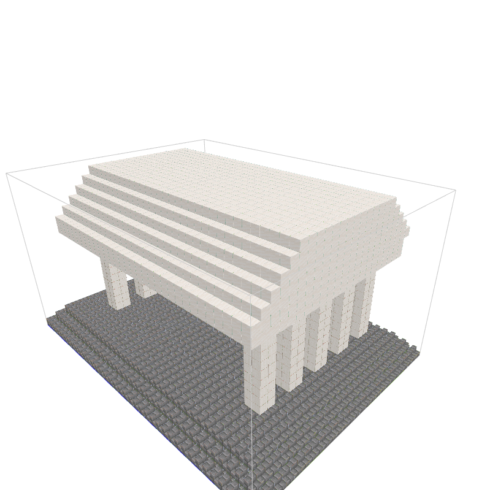
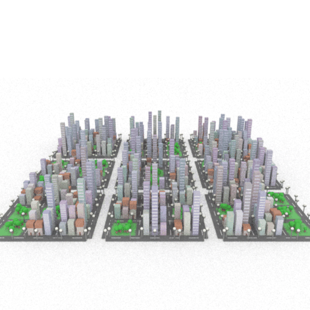
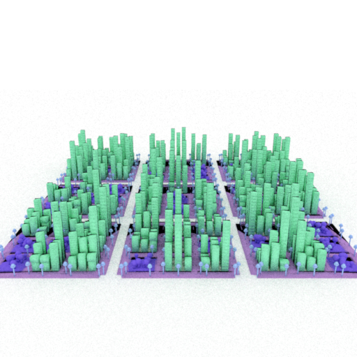
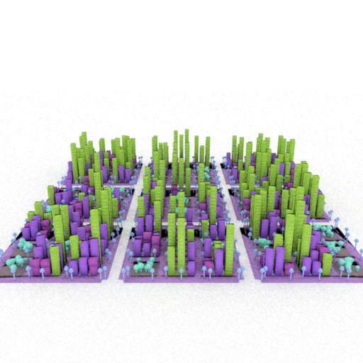
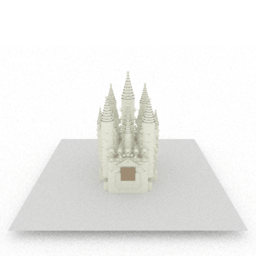
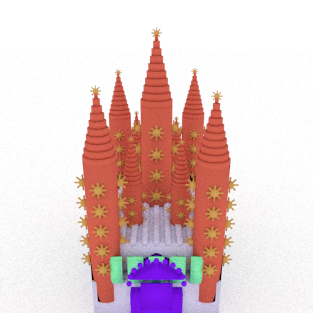

# The Scene Language: Representing Scenes with Programs, Words, and Embeddings

[arXiv](https://arxiv.org/abs/2410.16770) | [Project Page](https://ai.stanford.edu/~yzzhang/projects/scene-language/)

[Yunzhi Zhang](https://cs.stanford.edu/~yzzhang), [Zizhang Li](https://kyleleey.github.io/), Matt Zhou, [Shangzhe Wu](https://elliottwu.com/), [Jiajun Wu](https://jiajunwu.com/). CVPR 2025.


### Installation

#### Environment

```bash
conda create --name sclg python=3.12
conda activate sclg
pip install mitsuba  # tested for mitsuba==3.6.4
pip install unidecode Pillow anthropic transforms3d astor ipdb scipy jaxtyping imageio tqdm trimesh

# required for minecraft renderer
pip install spacy
python -m spacy download en_core_web_md

git clone https://github.com/zzyunzhi/scene-language.git
cd scene-language
pip install -e .
```
<!-- pip install --force-reinstall numpy==1.26.4  # to be compatible with transforms3d -->

<!-- If you want run neural renderers:
```bash
pip install opencv-python plyfile adan-pytorch plotly
``` -->

Run `python scripts/installation/test_install.py` to check if the installation is successful. 

#### Language Model API
Get your Anthropic API key following the [official documentation](https://docs.anthropic.com/en/api/getting-started#accessing-the-api)
and add it to `engine/key.py`:
```python
ANTHROPIC_API_KEY = 'YOUR_ANTHROPIC_API_KEY'
OPENAI_API_KEY = 'YOUR_OPENAI_API_KEY'  # optional, required for `LLM_PROVIDER='gpt'`
```

By default, we use Claude 3.7 Sonnet. You may switch to other language models by setting [`LLM_PROVIDER`](engine/constants.py#51).


### Text-Conditioned 3D Generation

#### Renderer: Mitsuba

```bash
python scripts/run.py --tasks "a chessboard with a full set of chess pieces" 
# Experimental
python scripts/run_self_reflect_with_moe.py --tasks "Sponge Bob and friends"
```
Renderings will be saved to `${PROJ_ROOT}/scripts/outputs/run_${timestep}_${uuid}/${scene_name}_${uuid}/${sample_index}/renderings/*.gif`. 

Example results with Claude 3.5 Sonnet (please use [this download link](https://downloads.cs.stanford.edu/viscam/SceneLanguage/resources/results.zip) for raw results including prompts, LLM responses, and renderings):

<table>
<tr>
<th width="20%">"a chessboard with a full set of chess pieces"</th>
<th width="20%">"A 9x9 Sudoku board partially filled with numbers"</th>
<th width="20%">"a scene inspired by Egon Schiele"</th>
<th width="20%">"a Roman Colosseum"</th>
<th width="20%">"a spider puppet"</th>
</tr>
<tr>
<td></td>
<td></td>
<td></td>
<td></td>
<td></td>
</tr>
</table>

#### Renderer: Minecraft

```bash
ENGINE_MODE=minecraft python scripts/run.py --tasks "a detailed cylindrical medieval tower"
```
Generated scenes are saved as json files in `${PROJ_ROOT}/scripts/outputs/run_${timestep}_${uuid}/${scene_name}_${uuid}/${sample_index}/renderings/*.json`.
For visualization, run the following command:
```bash
python viewers/minecraft/run.py
```
Then open [http://127.0.0.1:5001](http://127.0.0.1:5001) in your browser
and drag generated json files to the web page.

Example results:

<table>
<tr>
<th width="20%">"a witch's house in Halloween"</th>
<th width="20%">"a detailed cylindrical medieval tower"</th>
<th width="20%">"a detailed model of Picachu"</th>
<th width="20%">"Stonehenge"</th>
<th width="20%">"a Greek temple"</th>
</tr>
<tr>
<td></td>
<td></td>
<td></td>
<td></td>
<td></td>
</tr>
</table>


### Image-Conditioned 3D Generation
```bash
python scripts/run.py --tasks ./resources/examples/* --cond image --temperature 0.8
```

### Export Hierarchical Parts to Mesh

```bash
# Replace with your actual experiment paths, wildcards supported (e.g., "run_*/*/0" or "**/*")
python scripts/postprocess/export.py --exp-patterns "run_${timestep}_${uuid}/${scene_name}_${uuid}/${sample_index}"
```
The output will contain visualizations of hierarchial parts of the scene (see below, same color denotes the same hierarchy level), and exported `*.ply` files. Results in this section are obtained with Claude 3.7 Sonnet. Raw LLM outputs can be found in the same download link as above. 

<table>
<tr>
<th width="20%">"a large-scale city"</th>
<th width="20%">(depth=2)</th>
<th width="20%">(depth=3)</th>
<th width="20%">"Basilica de la Sagrada Familia"</th>
<th width="20%">(depth=2)</th>
</tr>
<tr>
<td></td>
<td></td>
<td></td>
<td></td>
<td></td>
</tr>
</table>


### Codebase Details

<details>
<summary>Macro definitions</summary>


The following table lists helper functions defined in [this](scripts/outputs/stubgen/20241020-145124-exposed-calc/header.pyi) file  in accordance with expressions defined in the domain-specific language (DSL) (Tables 2 and 5 of the paper):

| Implementation | DSL |
|----------------------|----------------|
| `register`           | `bind`         |
| `library_call`       | `call`         |
| `primitive_call`     | `call`         |
| `loop`               | `union-loop`   |
| `concat_shapes`      | `union`        |
| `transform_shape`    | `transform`    |
| `rotation_matrix`    | `rotation`     |
| `translation_matrix` | `translate`    |
| `scale_matrix`       | `scale`        |
| `reflection_matrix`  | `reflect`      |
| `compute_shape_center` | `compute-shape-center` |
| `compute_shape_min`  | `compute-shape-min` |
| `compute_shape_max`  | `compute-shape-max` |
| `compute_shape_sizes` | `compute-shape-sizes` |


</details>

### Limitations

The pipeline is sensitive to small changes in the prompts as shown [here](https://ai.stanford.edu/~yzzhang/projects/scene-language/#failure). 
It is recommended to run prompts with some variations for better results. 

### Codebase improvements

The current codebase allows you to generate 3D scenes with text or image prompts. 
Other tasks and renderers reported in the paper will be supported in future updates. 

Please open a github issue or [email](mailto:yzzhang@cs.stanford.edu) us if encountering any issues. 

### Citation

If you find this work useful, please consider cite the paper:

```bibtex
@inproceedings{zhang2025scenelanguage,
  title={The scene language: Representing scenes with programs, words, and embeddings},
  author={Zhang, Yunzhi and Li, Zizhang and Zhou, Matt and Wu, Shangzhe and Wu, Jiajun},
  booktitle={Proceedings of the Computer Vision and Pattern Recognition Conference},
  pages={24625--24634},
  year={2025}
}
```
